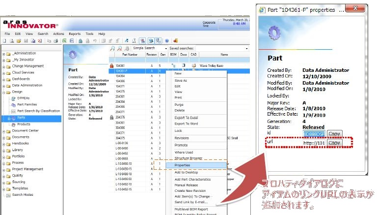

>## Archived Aras Community Project
*This project has been migrated to GitHub from the old Aras Projects page (http://www.aras.com/projects). As an Archived project, this project is no longer being actively developed or maintained.*

>*For current projects, please visit the new Aras Community Projects page on the updated Aras Community site: http://community.aras.com/projects*

# Add Item Link URL to Property Dialog

This project adds Item link url field to standard property dialog for any items.

You can easily get the link url like http://hostname/InnovatorServer/Client/default.aspx?StartItem=Part:XXXXXX.

**Supported Aras Versions:**

Project | Aras
--------|------
v11.6 | 11 SP6
v11.5 | 11 SP5
v9.4 | 9.4 SPx

###### *The Item Properties dialog, modified to show the selected item's URL.*

## History

Release notes/descriptions for the original project posted on the previous Aras Projects page.

Release | Notes
--------|--------
v11.6 | Support version 11SP6. Instructions are described in the [Documentation/ReadMe-Add Item URL with propsDialog.pdf](Documentation/ReadMe-Add%20Item%20URL%20with%20propsDialog.pdf).
v11.5 | Support version 11SP5. Instructions are described in the [Documentation/ReadMe-Add Item URL with propsDialog.pdf](Documentation/ReadMe-Add%20Item%20URL%20with%20propsDialog.pdf).
v9.4 | Build v9.4 is the first version. Instructions are described in the [Documentation/Add Item URL with propsDialog-ReadMe-Japanese.pdf](Documentation/Add%20Item%20URL%20with%20propsDialog-ReadMe-Japanese.pdf).

## Credits

**Project Owner:** NEOSYSTEM CO. Ltd.

**Original Idea:** NEOSYSTEM CO. Ltd.

**Created On:** April 16, 2014

## License
